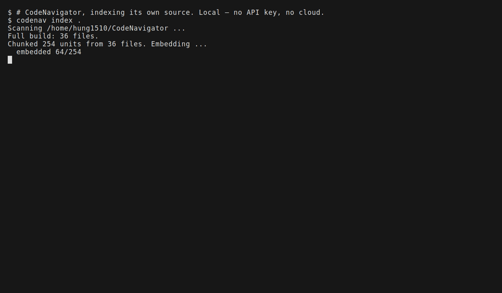

<div align="center">

# 🧭 CodeNavigator

**A local, MCP-native context engine for your codebase — so your AI assistant stops guessing.**

[](https://github.com/Hung1510/Code-Navigator/actions/workflows/ci.yml)
[](https://www.python.org/)
[](LICENSE)
[](#-use-it-as-an-mcp-context-engine)
[](#)
[](#)

</div>

Plug it into **Claude Desktop, Claude Code, Cursor, or Continue** and your
assistant gets precise, cited context from your repo — instead of grepping around
and dumping whole files into its context window. Or use it standalone: ask
*"where's the JWT refresh handled?"* or *"what calls `issue_jwt`?"* from the CLI
and get answers with `file:line` citations.

Everything runs locally: ONNX embeddings on CPU, a transparent vector store, BM25
keyword search, a cross-encoder re-ranker, and a tree-sitter call graph across 9
languages. No cloud, no API key required for MCP mode. Small enough to read in
one sitting, structured so every piece is swappable as you go deeper.

<div align="center">



</div>

### Highlights

- 🔌 **MCP context engine** — plug it into Claude Desktop / Claude Code / Cursor / Continue and your assistant gets precise, cited context instead of grepping and dumping whole files
- 🔍 **Hybrid retrieval** — semantic embeddings + BM25 keyword search, fused with Reciprocal Rank Fusion, then cross-encoder re-ranked
- 🌳 **Structure-aware chunking** via tree-sitter (Python, JS, TS/TSX, Rust, Java, C#, C++, Go) with a regex fallback
- 🧠 **Code intelligence** — `defs` / `callers` / `callees`, plus graph-aware answers that pull in the code your matches actually call
- 💥 **Impact analysis** — `impact` walks the call graph *transitively*: what breaks if you change this signature, not just who calls it directly
- 🧪 **Symbol → tests** — `tests` maps a function to the tests that reach it, **and the call chain that gets them there**. Neither is something grep or a vector store can give you
- ⚡ **Incremental indexing** — hashes files, re-embeds only what changed
- 📊 **Eval harness** — recall@k / MRR across modes, `--scaffold` for curated sets, `--fail-under` CI gate
- 🖥️ **CLI + desktop app** (Tauri) over one shared engine

## 🔌 Use it as an MCP context engine

This is the main event. Plug CodeNavigator into any MCP host and your AI
assistant stops grepping around your filesystem and dumping whole files into its
context. Instead it asks one question and gets a handful of ranked, deduplicated
chunks with `path:line` citations — plus the code those matches actually *call*,
via the call graph.

**It returns context, not answers.** The host's model does the reasoning, so the
MCP server needs **no API key**. Everything stays on your machine.

```bash
pip install -e ".[treesitter,mcp]"
```

### Claude Desktop

Settings → Developer → Edit Config, then add:

```json
{
  "mcpServers": {
    "codenavigator": {
      "command": "/absolute/path/to/.venv/bin/python",
      "args": ["-m", "codenavigator.mcp_server"],
      "env": {
        "CODENAVIGATOR_REPO": "/absolute/path/to/the/repo/you/want/to/ask/about"
      }
    }
  }
}
```

On Windows use the full interpreter path, e.g.
`"command": "D:\\Project_Programming\\CodeNavigator\\.venv\\Scripts\\python.exe"`.
Use **absolute paths** — the host spawns the server as a subprocess and won't
resolve `python` from your shell's PATH. Restart the host after editing.

### Claude Code

```bash
claude mcp add codenavigator \
  -e CODENAVIGATOR_REPO=/path/to/repo \
  -- /path/to/.venv/bin/python -m codenavigator.mcp_server
```

### Cursor / Continue / VS Code Copilot Agent

Same shape — point the host's MCP config (`~/.cursor/mcp.json` for Cursor) at
the same command, args, and `CODENAVIGATOR_REPO` env var.

### Tools it exposes

| Tool | What it's for |
|---|---|
| `search_code(query, k)` | Find code by meaning. Replaces grep + reading N files. |
| `ask_codebase(question, k)` | Same, plus call-graph expansion — the implementation, not just the match. |
| `get_definition(symbol)` | Where a function/class is defined. |
| `find_callers(symbol)` | Direct call sites — one hop. |
| `analyze_impact(symbol, depth)` | **Blast radius**: everything that *transitively* reaches it, with the chain, and an explicit uncertainty flag per result. |
| `find_tests(symbol, depth)` | **Which tests exercise it**, and via what call chain. |
| `find_callees(symbol)` | What an implementation depends on. |

It **auto-indexes on first use** and incrementally refreshes when files change,
so you never have to remember to re-index. Every response is **budget-capped**
(`CODENAVIGATOR_MAX_CHARS`, default 6000) with truncation markers that keep the
locator, so the model can always read further if it needs to.

| Env var | Default | Purpose |
|---|---|---|
| `CODENAVIGATOR_REPO` | `.` | Which repo the server serves |
| `CODENAVIGATOR_MAX_CHARS` | `6000` | Total response budget |
| `CODENAVIGATOR_MAX_CHUNK_CHARS` | `1800` | Per-chunk truncation cap |
| `CODENAVIGATOR_RERANK` | `1` | Set `0` to skip the cross-encoder |

**On "token savings":** retrieval doesn't beat a well-scoped question — it beats
the agent loop where the model greps, reads five files, and pastes them whole.
That's where the savings are, and that's the honest pitch: *precision context*.

## Quick start (CLI)

```bash
cd CodeNavigator
python -m venv .venv && source .venv/bin/activate   # Windows: .venv\Scripts\activate
pip install -e ".[treesitter]"     # includes parse-tree chunking (recommended)
# or: pip install -e .              # regex-heuristic chunking only, zero extra deps

# 1. Build the index for a repo (first run downloads a ~130MB ONNX model, once)
codenav index /path/to/your/repo

# Re-running is incremental: only changed/new/deleted files are touched, so
# it's near-instant. Force a clean rebuild with --full.
codenav index /path/to/your/repo            # fast: skips unchanged files
codenav index /path/to/your/repo --full     # rebuild everything

# 2a. Retrieval only — no API key needed, great for seeing what RAG returns
codenav search /path/to/your/repo "where is the jwt refresh token handled"
codenav search /path/to/repo "refreshToken" --mode lexical   # exact identifier
codenav search /path/to/repo "auth flow" --mode vector       # semantic only
# default --mode is hybrid (vector + BM25 keyword, fused)

# 2b. Full answer via Claude (needs an API key)
export ANTHROPIC_API_KEY=sk-ant-...
codenav ask /path/to/your/repo "how does auth refresh work? cite files"
codenav ask /path/to/repo "..." --no-rerank    # skip the cross-encoder stage
```

The index lives in `<repo>/.codenavigator/` — add that to your global gitignore.
Prefer a GUI? See `desktop/` for a Tauri app over this same engine.

### Excluding built or vendored copies

Duplicated build output (bundled JS, `dist/` copies) pollutes retrieval — the
index keeps returning duplicate copies instead of the source. Drop a
`.codenavigatorignore` (gitignore-flavored) at the repo root to keep them out:

```gitignore
client-dist/
public/js/
client/public/js/
*.min.js
**/vendor/**
```


### Code intelligence (call graph)

Structural questions, no embeddings or API key needed — built during `index`:

```bash
codenav defs    /path/to/repo AuthService.login   # where is it defined
codenav callers /path/to/repo issue_jwt           # what calls it (one hop)
codenav callees /path/to/repo AuthService.login   # what it calls

# Transitive: what breaks if I change this?
codenav impact  /path/to/repo issue_jwt --depth 3

# Which tests reach it — and through which helpers?
codenav tests   /path/to/repo issue_jwt
```

Same-file calls resolve exactly; cross-file calls resolve by name and report
all candidates when a name is defined in several places. Add `--json` to any.

### Measure retrieval quality (`eval`)

Turn "does hybrid/rerank help" into numbers on your own repo:

```bash
codenav eval /path/to/repo                 # auto name->code benchmark
codenav eval /path/to/repo --rerank        # also score the hybrid+rerank mode
codenav eval /path/to/repo --curated q.jsonl --kind both
```

Prints recall@1, recall@k, and MRR per mode (`vector`, `lexical`, `hybrid`,
optionally `hybrid+rerank`). The auto benchmark needs no labeling — it turns
each function name into a query and uses that function as the gold answer.
For realistic questions, write a curated JSONL (one object per line):

```json
{"query": "where is JWT refresh handled?", "path": "svc/auth.py", "start_line": 40, "end_line": 58}
```

Read the name-based numbers as "can it map a concept phrase to the right
function" — the name's words appear in the code, which favors keyword search,
so use a curated set for the cleanest semantic comparison. Example run (lexical
only, real BM25) across a few repos: recall@10 lands 0.94–1.0, but recall@1
varies a lot by repo — low recall@1 with high recall@10 is the signature of
similarly-named symbols, and the repo where semantic retrieval helps most.

**Scaffold a curated set** so you're not starting from a blank file — it emits
template rows for the repo's meatier functions with real paths/lines to attach
questions to:

```bash
codenav eval /path/to/repo --scaffold --max-items 30 > evals/myrepo.jsonl
# then edit each "query": "TODO: ..." into a real question
```

A starter curated set for smart-learning-advisor lives in
`evals/smart-learning-advisor.jsonl` (18 hand-written questions).

**Gate CI on retrieval quality** — fail the build when a change regresses it:

```bash
codenav eval /path/to/repo --check-mode hybrid \
  --fail-under "recall@10=0.6,mrr=0.35"     # exits 1 if below
```

`.github/workflows/ci.yml` wires this up: one job runs the unit tests, a second
indexes a corpus and runs the gate (calibrate the thresholds after the first
green run — set them ~10–15% below your observed numbers).

## How it works (the four moving parts)

```
  repo ─► chunker ─► embedder ─► store ──┐
          split on   text->vec   numpy    ├─► fuse (RRF) ─► rerank ─► LLM
          functions  (fastembed) cosine   │   vector +     cross-    grounded
                                 lexical ─┘   keyword       encoder   answer
                                 (BM25)
```

- **`chunker.py` + `treesitter.py`** — structure-aware splitting. With the
  `treesitter` extra installed, files are parsed into real syntax trees:
  callables are emitted whole (decorators/`export` included, nested closures
  kept with their parent), and containers are split into a header chunk plus
  one chunk per method with a qualified name (`SessionManager.invalidate`).
  Without the extra, it falls back to a dependency-free regex heuristic. Both
  produce identical `Chunk` objects. Supported grammars: Python, JS, TS/TSX,
  Rust, Java, C#, C++, Go. *This is where 80% of retrieval quality is won.*
- **`embedder.py`** — wraps [fastembed](https://github.com/qdrant/fastembed)
  (ONNX, CPU, no PyTorch). Default `BAAI/bge-small-en-v1.5`, 384-dim. Uses
  BGE's query/passage prefixes, which measurably improves retrieval.
- **`store.py`** — a vector store you can see through: unit vectors in a numpy
  matrix, metadata in SQLite, "search" is one dot product + argsort. This is
  what a vector DB *is*, minus the marketing.
- **`lexical.py` + hybrid retrieval** — a hand-rolled BM25 keyword index with a
  code-aware tokenizer (splits `refreshToken`/`refresh_token` into subwords).
  By default `query.py` runs both vector and BM25 search and fuses them with
  Reciprocal Rank Fusion, so semantic questions *and* exact identifier lookups
  both land. Choose one with `--mode vector|lexical|hybrid`.
- **`rerank.py` — two-stage retrieval.** An optional ONNX cross-encoder
  re-scores the fused top ~30 candidates by reading query+chunk *together*, then
  keeps the best k. On by default; skip with `--no-rerank`. Falls back to the
  fused order if the model isn't available.
- **`index.py`** — builds the index **incrementally**. It hashes every source
  file and compares against the `{path: hash}` manifest from the last run, so
  only changed, new, or deleted files are re-chunked and re-embedded. Embedding
  is the one expensive step; everything else is cheap, so a re-index after a
  small edit is near-instant. Switching embedding models triggers a full
  rebuild automatically (mixing vectors from two models would corrupt search).
- **`callgraph.py` — code intelligence.** Reuses the tree-sitter parse to
  extract definitions and call sites, then resolves each call to its
  definition: exact within a file, name-based across files (reporting *all*
  candidates when ambiguous rather than guessing). Powers the `defs`, `callers`,
  and `callees` commands — and **graph-aware `ask`**: retrieval finds the code a
  question is about, then the graph pulls in the code that code *calls* (marked
  `\u2190 called by X`), so the LLM answers from the real implementation, not
  just lexical look-alikes. On by default for `ask`; `--no-expand` to disable.
- **`llm.py`** — hands retrieved chunks to Claude with a strict "answer only
  from context, cite locators" prompt.
- **`desktop/`** — a Tauri 2 desktop app over this engine (Rust backend runs the
  CLI with `--json`, static web frontend renders it). See `desktop/README.md`.

## Verify it works (offline, no downloads)

```bash
pip install pytest numpy && python -m pytest -q
```

The test injects a fake embedder, so the full chunk→embed→store→retrieve loop
runs with no network and no API key.

## Where to grow it (in rough order of payoff)

1. ~~Tree-sitter chunking~~ — **done** (`treesitter.py`). Next grammar-side win:
   capture interspersed top-level statements between defs, and add
   `type_alias`/`record` node types where you need them.
2. ~~Incremental indexing~~ — **done** (`index.py`). Next: the store still
   rewrites `vectors.npy` in full on each save; append-only persistence would
   make large-repo writes cheaper too.
3. ~~Hybrid retrieval~~ — **done** (`lexical.py`, RRF fusion in `query.py`).
4. ~~Cross-encoder re-ranker~~ — **done** (`rerank.py`, two-stage in `query.py`).
5. ~~Desktop shell~~ — **done** (`desktop/`, Tauri 2 over the CLI).
6. ~~Call graph / code intelligence~~ — **done** (`callgraph.py`: `defs`,
   `callers`, `callees`). Next: import-aware resolution to disambiguate
   cross-file candidates, and receiver-type tracking for method calls.
7. ~~Graph-aware `ask`~~ — **done** (`_expand_with_graph` in `query.py`): the
   top hits' callees are pulled into the LLM context. Next: expand callers too
   for "impact of changing X" questions, and go one hop deeper when budget allows.
8. ~~Evaluation harness~~ — **done** (`eval.py`: `codenav eval`, recall@k / MRR
   across modes; `--scaffold` for curated templates; `--fail-under` CI gate in
   `.github/workflows/ci.yml`). Next: a docstring->code dataset (less name
   leakage) and per-query drill-down to see *what* each mode misses.
9. ~~Exclude built/vendored copies from indexing~~ — **done**
   (`.codenavigatorignore`, gitignore-flavored, honored by indexing, the call
   graph, and eval). Duplicate copies are a measurable recall drag.
10. **Swap the store** — LanceDB/Qdrant behind the `VectorStore` interface once
    you outgrow brute-force numpy (~50k+ chunks).
11. **Desktop graph panel + streaming progress** — expose the graph verbs in the
    Tauri app (the `--json` output is ready) and stream index progress as events.

## Known limitations (tree-sitter path)

- **`impact` and `tests` are heuristics, and I'd rather you know how they fail
  than be impressed by them.** Cross-file call resolution is name-based, not
  type-aware — there's no compiler here. Two consequences, both surfaced in the
  output rather than hidden:
  - *Over-reporting.* If several files define `save`, a call to `save` resolves
    to all of them. Results reached that way are marked `?`, and the doubt is
    **inherited** by everything downstream — error compounds with `--depth`, so
    the tree can't quietly launder a guess into a fact three hops later.
  - *Under-reporting.* Dynamic dispatch, reflection, DI containers, HTTP routes
    and mocks leave no static call edge. So an empty `impact` result does **not**
    mean a change is safe, and an empty `tests` result does **not** mean the code
    is untested. Both say "nothing *statically* reaches this", which is a weaker
    claim than it looks. An LSP would settle much of this; that's the upgrade
    path, not a patch.
- Top-level statements *between* two definitions aren't chunked (only the
  module preamble before the first definition is). Rare in the supported
  languages; the fallback windows anything with no definitions at all.
- A grammar not in the `treesitter` extra falls back to regex automatically.

## Config

| Env var | Default | Purpose |
|---|---|---|
| `ANTHROPIC_API_KEY` | — | required for `ask` |
| `CODENAVIGATOR_MODEL` | `claude-sonnet-5` | answer model |
| `--model` flag | `BAAI/bge-small-en-v1.5` | embedding model |
